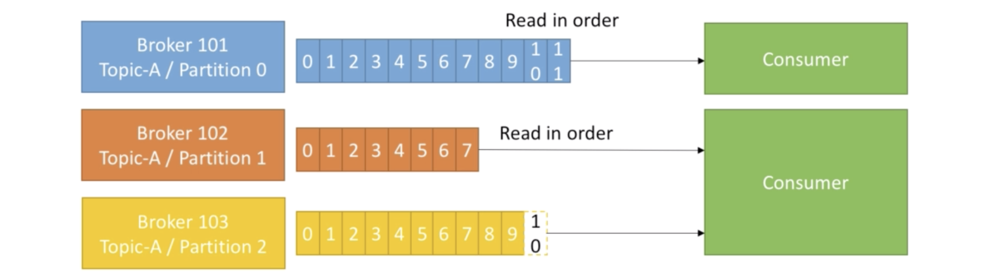

# Kafka

## Fundamentals

### 1. Topic, Partitions and Offsets
- A particular stream of data.
- Similar to a table in a database (without all constraints).
- You can have as many topics as you want.
- A topic is identified by its name.
- Topics are split into partitions

- Each partition is ordered
- Each message within a partition gets an incremental id, called offset.
- Partitions does not necessarily have same number of messages.
- A message can be identified by topic `<kafka-topic>`, partition `<partition-number>` and offset `<offset-number>`.
- Example:
    - A trucking company has a fleet of trucks, each truck reports its GPS position to Kafka.
    - A topic `trucks_gps` can be present that contains position of all trucks.
    - Each truck will send a message to kafka every 20 seconds, each message will contain the `truck_id` and `truck_position` (latitude & longitude).
    - All the trucks are going to send their data to the same topic.
    - 10 partitions (arbitrarily) can be created in the topic.
    - There can be many consumers for the data, eg. location dashboard to track employees, notification service for when the truck is running out of fuel etc.
- Offsets only have meaning for a specific partition. Eg. offset 3 in partition 0 doesn't represent the same data as offset 3 in partition 1.
- Order is guaranteed only within a partition (not across partitions).
- Data is kept only for a limited period of time, default is one week.
- Once written, data cannot be mutated.
- Data is assigned randomly to a partition unless a key is provided.

### 2. Brokers
- What holds topics? Brokers.
- A kafka cluster consists of multiple brokers (servers).
- Each broker is identified by an id (integer).
- Each broker will contain only certain topic partitions. Each broker has some data, but not all the data (distributed).
- One can connect to the entire kafka cluster by connecting to any broker (called a bootstrap broker).
- A good number to get started is 3 brokers, but some big clusters have been known to have over 100 brokers.
- Example:
    - We choose to (arbitrarily) number the brokers starting from 100. So there are 3 brokers, `broker-101`, `broker-102` and `broker-103`.
    - There's a topic called `Topic-A`. `Topic-A` has three partitions, `broker-101` has `Partion 0`, `broker-101` has `Partion 2` and `broker-102` has `Partition 1`.
    - There's another topic called `Topic-B` with two partitions, `broker-101` has `Partition 1` and `broker-102` has `Partition 0`, and `broker-103` does not hold any data from `Topic-B`.
    
- Replication Factor:
    - Topics should have a replication factor greater than 1, usually between 2 and 3 (3 being the safe choice).
    - This way if a broker is down, another broker can serve data.
    - Example:
        - `Topic-A` with two partitions and a replication factor of two. `broker-101` and `broker-102` will have `Partition 0` of `Topic-A` and `broker-102` and `broker-103` will have `Partition 1` of `Topic-A`.
        
        - Suppose we lose `broker-102`, `broker-101` and `broker-103` can still serve data.
    - At any certain time, only one broker can be a leader for a given partition.
    - Only that leader can receive and serve data for a partition.
    - The other brokers will just be passive replicas and just synchronize the data.
    - Therefore, each partition has one leader and multiple ISR (in-sync replica).
    
    - The leaders and ISRs are determined by the `zookeeper`.
    
### 3. Producers
- Producers write data to topics (which is made of partitions).
- Producers automatically know to which broker and partition to write to.
- In case of broker failures, Producers will automatically recover.

- If the message is sent without a key, then the data will be sent round robin to `broker-101`, `broker-102` and `broker-103`.
- Producers can choose to receive acknowledgement of data writes. There are three acknowledgment modes:
    - In `acks=0`, Producer won't wait for acknowledgment (possible data loss).
    - In `acks=1`, Producer will wait for the leader to acknowledge (default, limited data loss).
    - In `acks=2`, Leader + replicas, all have to acknowledge (no data loss).
- Message keys:
    - Producers can choose to send a `key` with the message (string, number, etc).
    - If key is `null`, data is sent round robin (`broker-101`, then `broker-102` and finally `broker-103`).
    - If a key is sent, then all messages for that key will go to the same partition.
    - A key is basically sent if you need message ordering for a specific field (eg. `truck_id`).
    
    - Mechanism of key to partition is hashing, called key hashing. We don't specify which key goes to which partition but can guarantee that a certain key will always go to the same partition.

### 4. Consumers
- Consumers read data from a topic (identified by name).
- Consumers know which broker to read from.
- In case of broker failures, consumers will also know how to recover.
- Data is read in order within each partition.

- Consumer groups:
    - Consumers read data in consumer groups.
    - Each consumer in a group reads from exclusive partitions.
    - If you have more consumers than partitions, come consumers will be inactive.
    
    

### 5. Consumer offsets
- Kafka stores the offsets at which the consumer has been reading, consider it as checkpoint or bookmarking.
- The offsets are committed (stored) live in a kafka topic called `__consumer_offsets`.
- When a consumer in a group has processed data received from kafka, it should be committing the offsets.
- If a consumer dies, it will be able to read back from where it left off, thanks to the committed consumer offsets.

- Delivery Semantics for consumers:
    - Consumers choose when to commit the offsets.
    - There are three delivery semantics:
        1. `At most once`
            - Offsets are committed as soon as the message is received.
            - If the processing goes wrong, it will be lost and won't be read again.
            - Not preferred.
        2. `At least once`
            - Offsets are committed after the message is processed.
            - If the processing goes wrong, the message will be read again.
            - This can result in duplicate processing of messages so it is to be made sure that the processing is idempotent, i.e. processing the messages again won't impact the system.
            - Usually preferred.
        3. `Exactly once`
            - Can be achieved for kafka to kafka workflows only using kafka streams API.
            - For kafka to external system workflows, use and idempotent consumer.

### 6. Kafka broker discovery
- Every kafka broker is also called a `bootstrap server`.
- This means that we only need to connect to one broker and we will be connected to the entire cluster.
- Each broker knows about all brokers, topics and partitions (metadata).

### 7. Zookeeper
- Zookeeper manages the brokers (keeps a list of them).
- Zookeeper helps in performing leader election for partitions.
- Zookeeper sends notifications to kafka in case of changes such as new topic, broker dies, broker comes up, topics are deleted etc.
- Kafka cannot work without zookeeper.
- Zookeeper by design operated with an odd number of servers (3, 5, 7).
- Zookeeper has a leader (handles writes) the rest of the servers are followers (handle reads).
- Zookeeper does not store consumer offsets with kafka > v0.10.

### 8. Kafka guarantees
- Messages are appended to a topic-partition in the order that they're sent.
- Consumers read the messages in the order stored in topic-partition.
- With replication factor of N, producers and consumers can tolerate upto N - 1 brokers being down.
- This is why a replication factor of 3 is a good idea:
    - One broker can be taken down for maintenance.
    - One broker can be taken down unexpectedly.
- As long as the number of partitions remain constant for a topic (no new partitions), same key will always go to the same partition.

